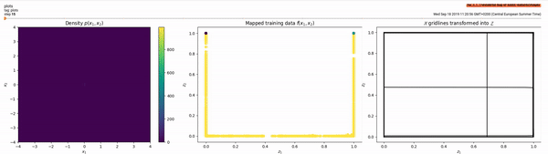
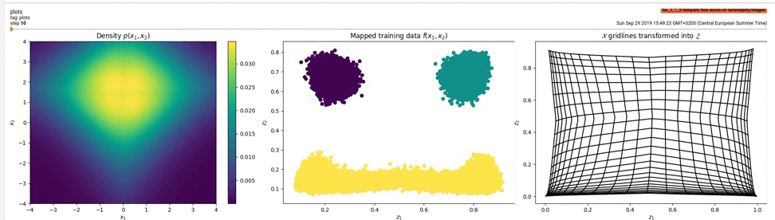
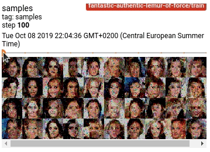

# CS294-158-homeworks
My homework solutions for [UC Berkeley CS294: deep unsupervised learning](https://sites.google.com/view/berkeley-cs294-158-sp19/home) (I did not take part in that course).

I used Tensorflow 1 and Jupyter notebooks for the first homework, but starting from the second one i will use Tensorflow 2, Python scripts instead of notebooks and store visualizations in Tensorboard.

### Homework 2

#### Task 1.1

#### Task 1.2
This task is suprisingly more complex than 1.1 &ndash; I have encountered a lot of problems, and the final density plot
does not look so convincing. Here are some things that are not described in the assignment / papers that I had to tweak:
- determinant of the sigmoid flow must be clipped from below with a small value like `1e-10`, otherwise when a coordinate
is transformed into 0 or 1 by the flow, the determinant will be 0. Although the sigmoid function never achieves 0 or
1 values, due to float precision `tf.math.sigmoid(20.)` will return 1. Then the gradient of the sigmoid will be 
calculated as 0, and log determinant of the sigmoid flow will become negative infinity. It may be that this problem
only arises because of a mistake in my implementation, and in the correct implementation the last sigmoid flow will
never receive such large values. The sigmoid in the scaling part of the affine coupling flow must be bounded from below 
for the same reason.
- the official Glow implementation uses a different formula for the affine coupling layer that limits how much the 
inputs can be scaled up: `(x2 + t(x1)) * sigmoid(s(x1) + 2)`.
This prevents the gradients from growing too large and makes the training more stable. Check out the discussion of the
scale term calculation here: 
https://github.com/openai/glow/issues/62. The `+2` part inside of the sigmoid pushes the initial scales into the 1 
region, i guess? And away from the 0 region that would make the log determinant explode.

You can see in the density plot that all regions of high density are connected with each other through small threads of
high density. Throughout all my trials I've never observed a clean separation between modes like in the density plot of
the flow from the task 1.1.

#### Task 2
Some useful resources that I read while implementing this task:
- https://github.com/MokkeMeguru/glow-realnvp-tutorial Tensorflow 2.0 + TF Probability implementations of
RealNVP and Glow
- https://github.com/openai/glow/ official Tensorflow implementation of Glow. Some minor details are different from 
the paper or not covered there! For example, the affine coupling layer scaling thing from [Task 1.2](#task-12).

Have not read but plan to:
- [Understanding Tensorflow Probability distribution shapes](https://github.com/tensorflow/probability/blob/r0.8/tensorflow_probability/examples/jupyter_notebooks/Understanding_TensorFlow_Distributions_Shapes.ipynb)

##### RealNVP-like model
The bijector chain is 
`task_2_2.chains.default_chain` with `filters=256, blocks=6`. It took 7k epochs with batch size 64 and learning rates
5e-4 (first 4.5k epochs) then 2.5e-4 (last 2.5k epochs) to train to 0.64 bits/dim.

Some samples from this model:

